# A/O Relay

## Requirement

- Flat Head Screwdriver (0.5 x 3.0)
- Test Rig
- 4-conductor cable
- Multi Meter
- AO Relay Enclosure

## Test Rig Prerequisite

### Wiring the module to test rig

- Use a 4-conductor wire to the Test Rig, apply the +24V, -24V, -485, and +485

- Plug in the corresponding +24V, -24V, -485, +485, -24V wire to the 6-position terminal block on the A3017 board.

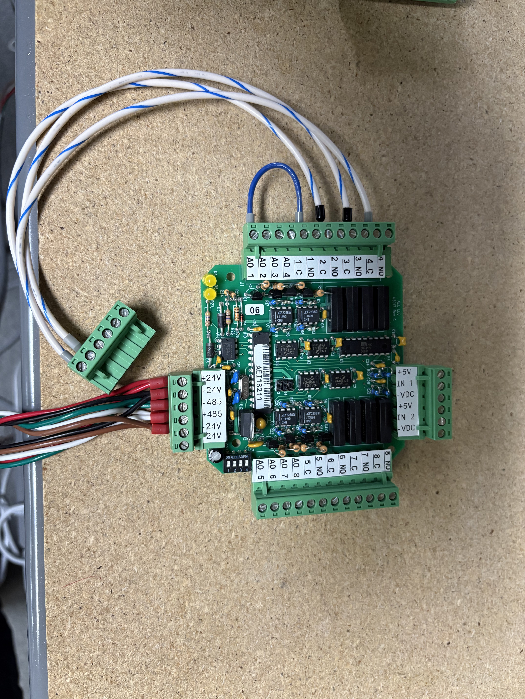

+24V, -24V, -485, +485, -24V plugged into the 6-position terminal block

- On the A3009 from the Test Rig, bring the COM Port to connect to the desired serial port
- Turn on the breaker

## Running the Bus Scanner

- Run the bus scanner program on the Tools folder on W:\MN\Control Systems\Software\Echo Bus and Bus Scanner\echobus.exe
  - A web browser will open at http://localhost:5001

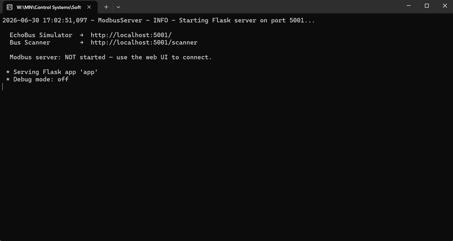

Echobus application running

  - Alternate way of opening Bus Scanner is by entering the link on the search bar http://localhost:5001/scanner

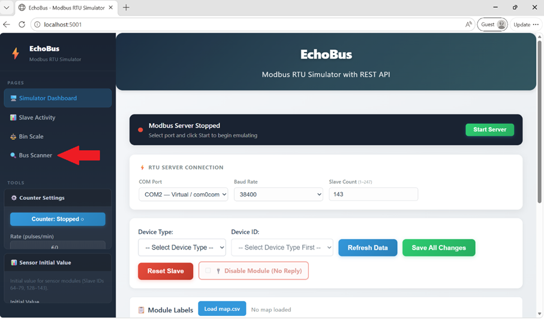

Bus Scanner found on the left side under Pages

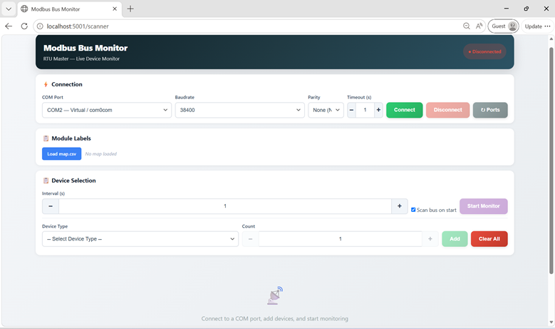

  - A disconnected highlighted text on top right will show if you have not made the COM Port connection that your Rig Test is connected onto serial port.

- 

- Once the bus scanner is opened, hover over COM Port and select the appropriate COM port being used from the Test Rig to the connected serial port, then click Connect.
  - Leave Baud Rate, Parity, and Timeout(s) to normal setting.
  - If the connection is not valid, the message "Cannot Open Com" will appear.
    - Verify the COM wiring on the test rig
    - Verify COM Port connection to the Serial Port.

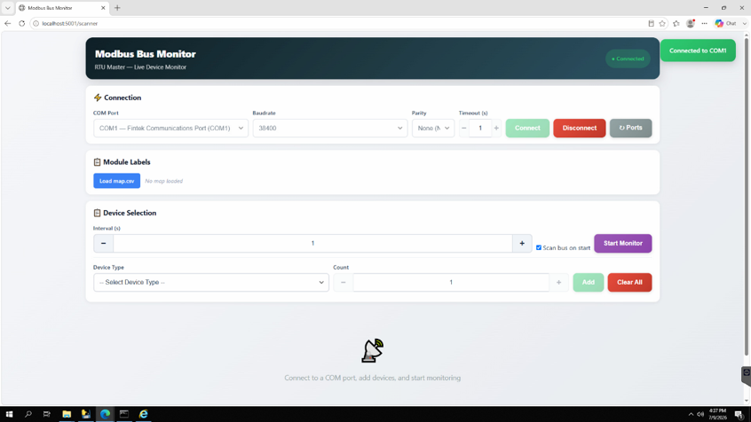

COM Port 1 connection successful

### Device Selection

- On Device Type, select AO/Relay (16 devices)

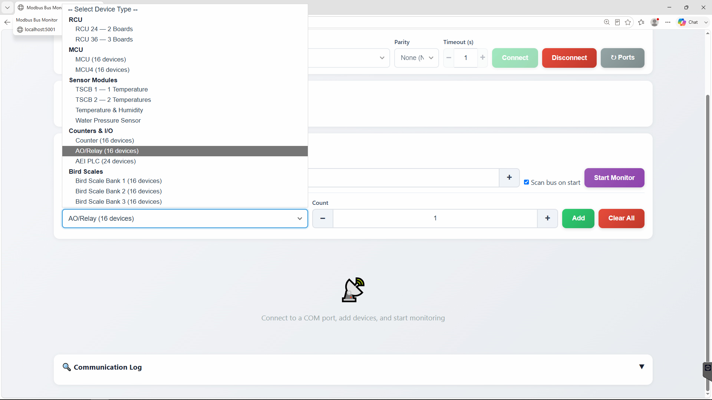

- Add the number of Counter Module based on Device ID
  - Device ID = module number
  - Adjust the modbus dip switch address based on the module number
    - I.e., AO Module 2-4 set dip switches to 2,3, and 4, then select Device ID of 2-4 for the number of sensors.

- Click on Add and Start Monitor

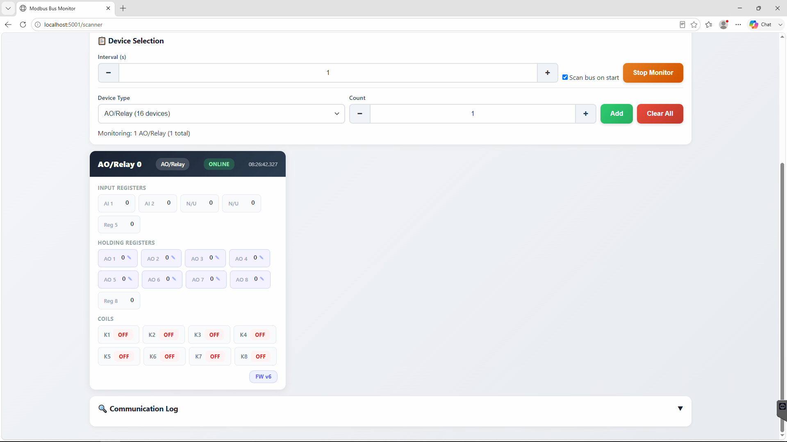

Once the AO Relay device IDs are added and monitoring, the AO Relay module device ID will be displayed and ready to test.

## AO Relay Test

### Volt Measurement Test

- Check `map.csv` for changes to AO Relay setup (for example, if no egg speed/egg start, remove the blue wire jumper between AO 1 and AO 4).
- Plug AO Relay into the same cable used for counters.
  - AO Relay causes INT to trigger and can be used to test INT on counters.

- Select AO Relay in Modbus Monitor with corresponding Device IDs.
- Set AO Relay holding register (Reg 1) to 5000.

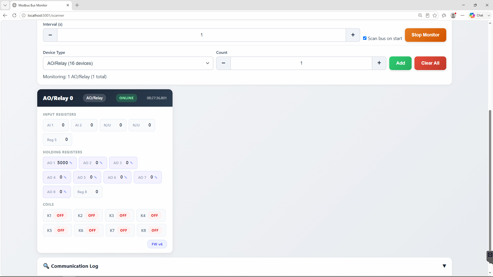

AO1 entered with value of 5000

- Set a multimeter to measure DC Voltage.
- Placing the black probe on -24V and the red probe on AO 1 measure the voltage (the 5000 set in step 3 should equal 5V).

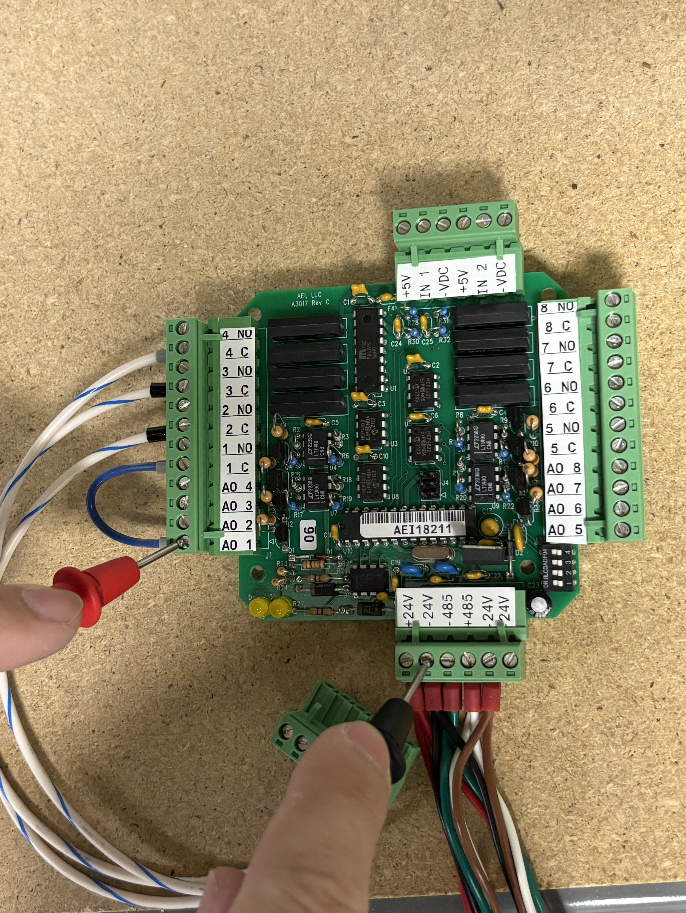

Black probe on -24V and red probe on AO1

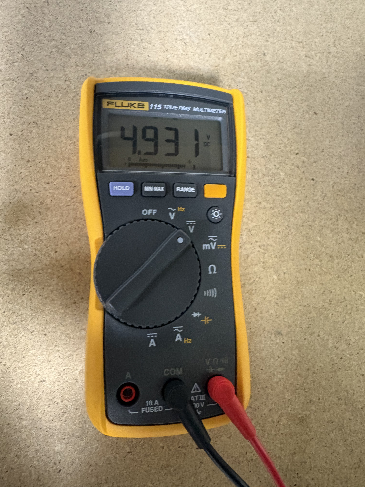

Multimeter reading approximate 5.0V

- Reset the holding register to 0.
- Repeat steps 3-6 for the remaining holding registers and measure the corresponding AO on the A3017 board.

### Continuity Test

- Set the multimeter to the continuity setting.

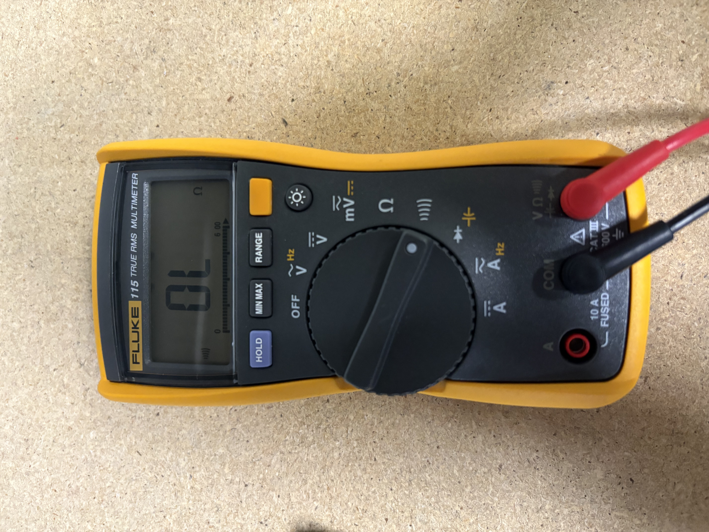

Multimeter on continuity setting

- Check for close between 1 C and 1 NO (No beep).
- In Modbus Monitor toggle Coils #0.

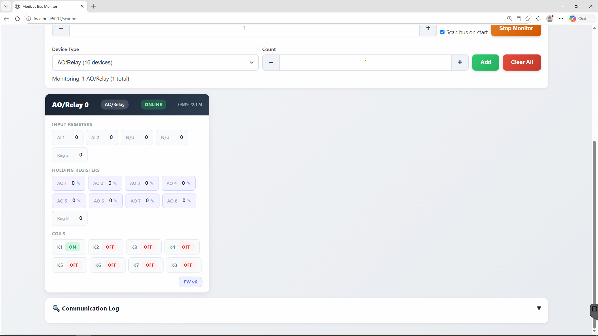

Coil #0 toggled ON

- Check for open between 1 C and 1 NO (beep).

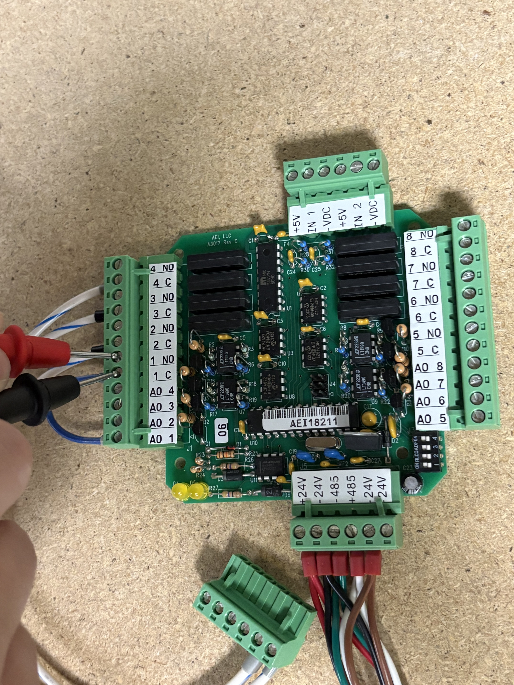

Checking for open between 1C and 1NO

- Repeat steps 8-11 for the remaining Coils and corresponding C and NO on A3017 board.

