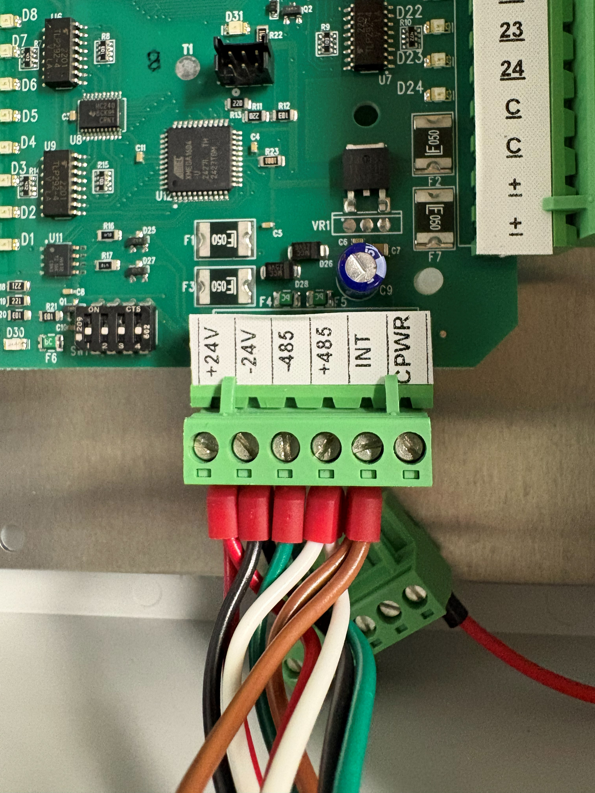
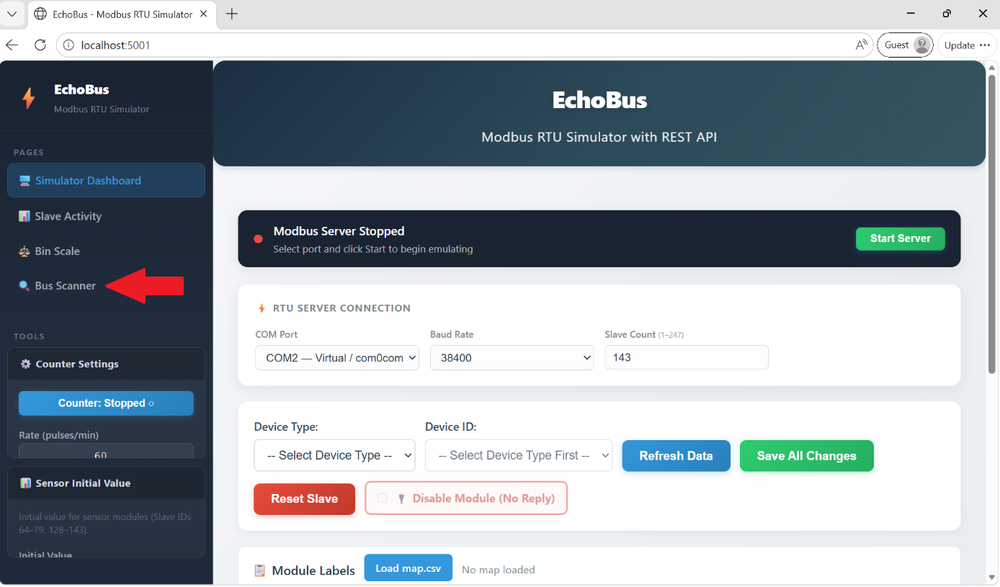
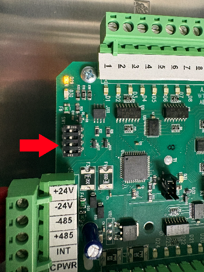
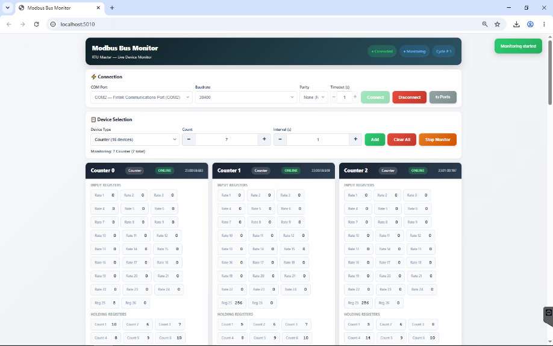
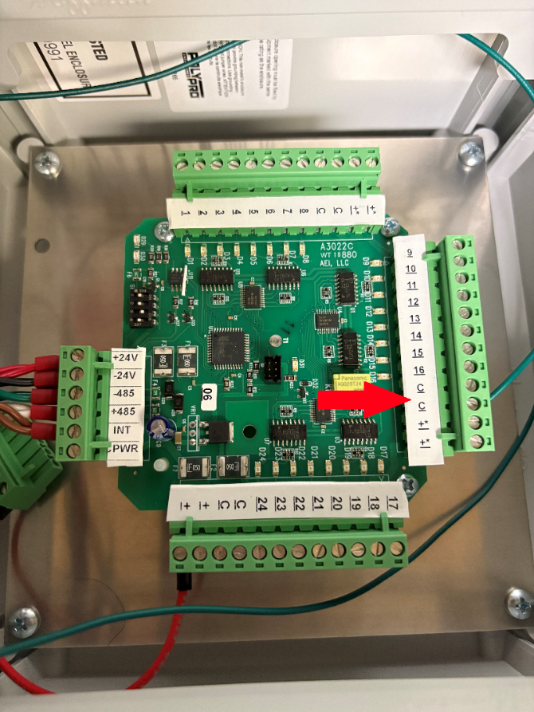
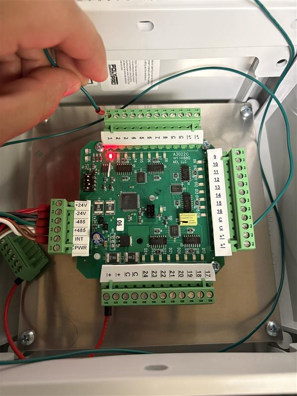
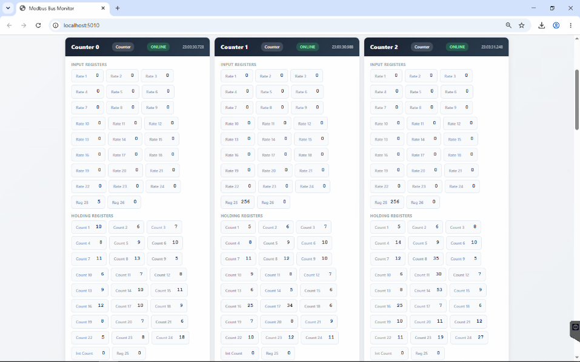

# Counter Box/Input Enclosure Test

## Requirements

- Flat Head Screwdriver (0.5 x 3.0)
- Test Rig
- Jumper cable
- Counter Box(s)

## Test Rig Prerequisite

### Wiring the counter module to test rig

- Use the Counter cable to wire in to the Counter <-> Test Rig

- Plug in the +24V, -24V, -485, +485, Int (optional) wire to the corresponding wago nut on the Test rig and on the 6 position terminal block on Counter Module

+24V, -24V, -485, +485, Int (optional) wired in

- On the A3009, bring the COM Port to the desired serial port to your test computer.
- Turn on the breaker on the Test Rig

## Running the Bus Scanner

- On the test computer run the bus scanner program on the folder: W:\MN\Control Systems\Software\Echo Bus and Bus Scanner\echobus.exe
  - A web browser will open with the localhost 5001

Echoubs application running

- Under Pages click on Bus Scanner to open the application
  - Alternate way of opening Bus Scanner is by entering http://localhost:5001/scanner on the search bar.

Bus Scanner found on the left side under Pages

- Once the bus scanner is opened, hover over COM Port and select the appropriate COM port being used from the Test Rig to the connected serial port, then click Connect.
  - Leave Baud Rate, Parity, and Timeout(s) to normal setting.
  - If the connection is not valid, the message "Cannot Open Com" will appear.
    - Verify the COM wiring on the test rig
    - Verify COM Port connection to the Serial Port.

COM Port 1 connection successful

### Device Selection

- On Device Type, select Counter (16 devices)
- Add necessary count for the number of counters to test.
  - Count = modbus addr from the counter module number
  - Adjust the modbus dip switch addr based on counter module number
    - E.g., Counter Module 0-2 set dip switches to 1, 2, and 0. Select Count of 2 for the number of counters.

Modbus dip switch on Counter. This counter is set for module 0.

- Click on Add and Start Monitor.

Once the Counter device IDs are added and monitoring. The device ID of the Counter will be displayed and ready to test.

## Counter Test

- Wire a jumper in the C input on the A3022 board.
  - The end of the wire will be used to count your inputs 1-8, 9-16, and 17-24

Jumper wired in the C input; any C input location can be used.

- Make a sequence count starting from 5 counts to 12 counts on each input, pressing down the jumper on the dedicated input.
  - Input 1 = 5 counts, Input 8 = 12 counts, etc., and the value should match in Holding Register.

Jumper on Input 1, tapping 5 counts

On the bus scanner application, view the tested Counter number

- Under Holding Register verify that:
  - The counts match with the corresponding input that is being tested.
  - If the counts do not match, the inputs may be incorrect or the board may be faulty.
    - On startup, verify that counter LEDs D29 and D30 blink.
    - Replace a bad board and leave a tag with your findings.

- Repeat the sequence count for the rest of the inputs.
- If the counter box requires a front label
  - Use the brady printer, write the Module number and description based on the customer Map file of the counter.
    - Module 0 Row 1 Counters, e.g.
    - Module 6 Alarms & Water Meters

  - Include the Counter Assignment, if necessary, on the back of the front door of the Enclosure.

- After QC, record the Inventory Tracking and Serial Number Tracking

Counters 0-2, under Holding Register, includes the counts for all inputs.

