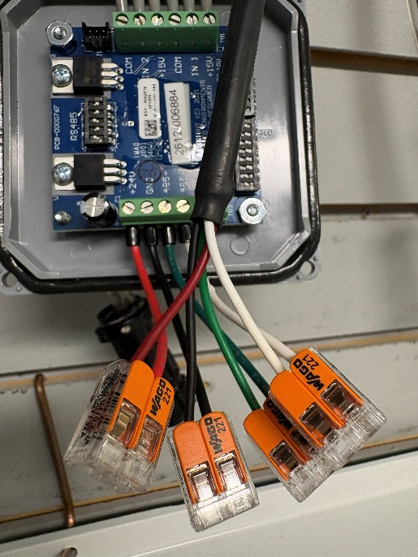
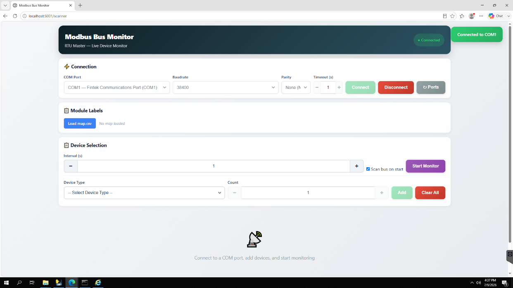
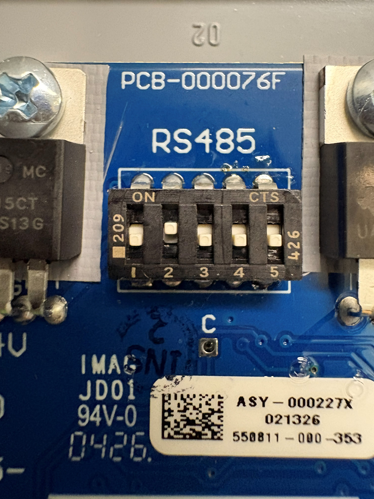
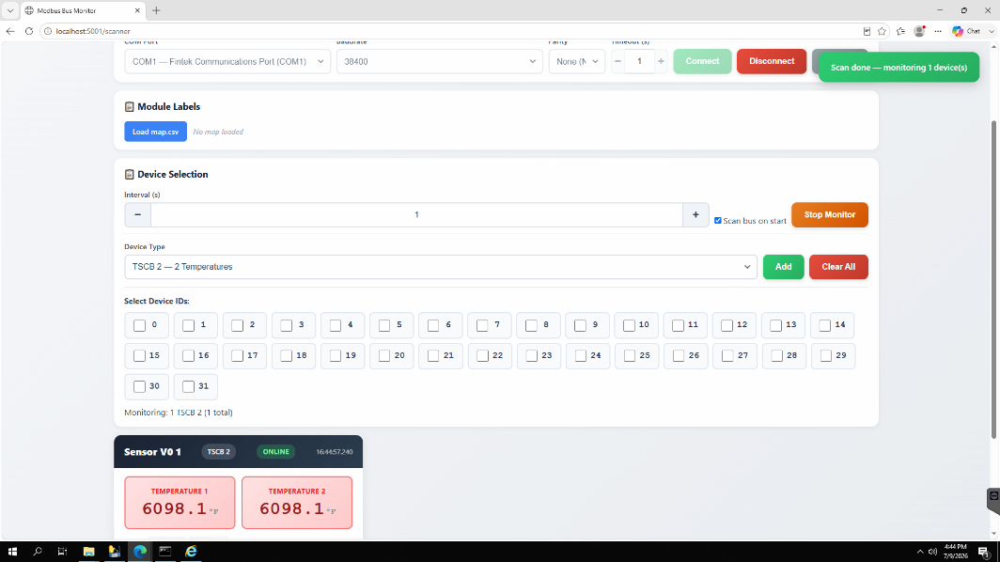
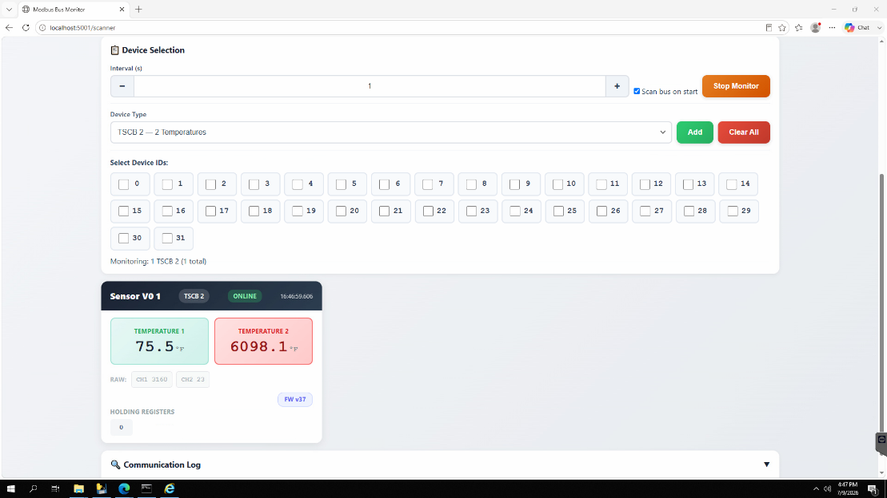
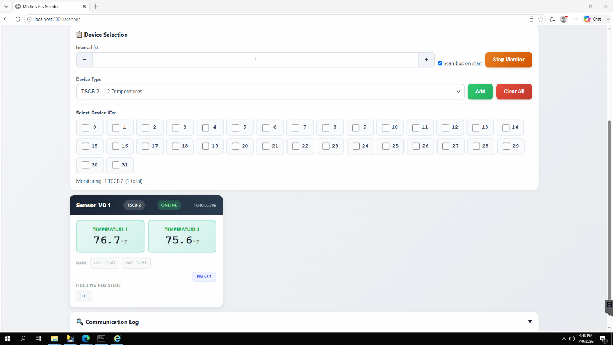
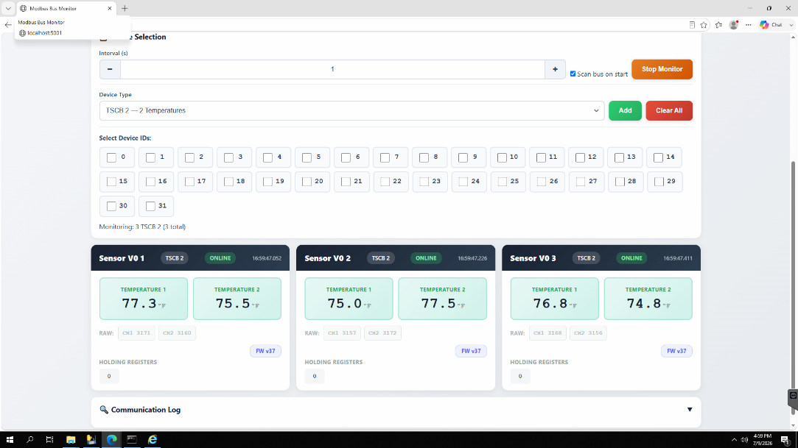

# TSCB-2

## Requirement

- Flat Head Screwdriver (0.5 x 3.0)
- Test Rig
- Sensors Cable
- Temperature sensor tester
- TSCB-2

## Test Rig Prerequisite

### Wiring the module to test rig

Use the Sensor cable to wire in to Test Rig and insert the 4-conductor wire to the wago nuts on the Sensor Module.

- Plug in +24V, -24V, -485, +485 wire to the corresponding wago nut on TSCB-2

+24V, -24V, -485, +485 connected

- Wire the other end of the cable into the Test Rig:
  - +24VDC, -24VDC, -485, +-485.
  - +485 will be in the top level of the 3-tier level.

- On A3009, bring the COM Port to connect to the desired serial port.
- Turn the breaker on.

## Running the Bus Scanner

- Run the bus scanner program on the Tools folder on W:\MN\Control Systems\Software\Echo Bus and Bus Scanner\echobus.exe
  - A web browser will open at http://localhost:5001

Echobus application running

- Under Pages click on Bus Scanner to open the application
  - Alternate way of opening Bus Scanner is by entering http://localhost:5001/scanner on the search bar.

Bus Scanner found on the left side under Pages

- Once the bus scanner is opened, hover over COM Port and select the appropriate COM port being used from the Test Rig to the connected serial port, then click Connect.
  - Leave Baud Rate, Parity, and Timeout(s) to normal setting.
  - If the connection is not valid, the message "Cannot Open Com" will appear.
    - Verify the COM wiring on the test rig
    - Verify COM Port connection to the Serial Port.

COM Port 1 connection successful

### Device Selection

- On Device Type, select TSCB-2 -2 Temperature
- Add the number of Counter Module based on Device ID
  - Device ID = module number on sensor
  - Adjust the modbus dip switch address based on the module number
    - I.e., Sensor Module 2-4 set dip switches to 2,3, and 4, then select Device ID of 2-4 for the number of sensors.

The Modbus dip switch is located under "RS485". I.e. this sensor module is set to Module 2.

- Click on Add and Start Monitor.

Once the TSCB device IDs are added and monitoring, the Sensor Module device ID will be displayed and ready to test.

## TSCB-2 Test

- On the TSCB-2, use a temperature sensor and plug the sensor on label 1 connector.
  - On the Bus Scanner dashboard, verify that Temperature 1 is reading values around ~70-80 degrees range or close to room temperature.

Temperature sensor plugged onto label 1 connector

- Repeat Step 1 for the sensor label 2

Temperature sensor plugged onto label 2 connector

- Repeat the test for all necessary TSCBs accounted.

Sensor Modules 1-3 successfully tested and reading room temperature

- Verify Temperature 1 and 2 on the Bus Scanner are in room temperature range
- If necessary, label the sensor module, e.g., Module 2, based on the Sensor Module # on the customer Map file.
- Record the Serial Number Tracking and Inventory Tracking

