## MCU - 1

## Requirements

- Flat Head Screwdriver (0.5 x 3.0)
- Test Rig
- MCU Cable
- MCU(s)
- Signal Generator with MCU Static Pressure test

## Test Rig Prerequisite

### Wiring the module to test rig

- Use the MCU cable to wire in to the Test Rig and plug the six position terminal block to the MCU.
- Plug in the +24V, -24V, -485, +485, WDT wire to the corresponding wago nut on the Test rig and on the 6 position terminal block on MCU Module.

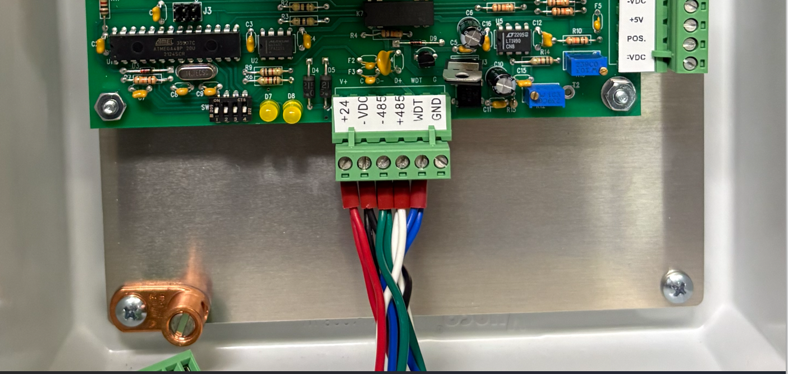

+24V, -24V, -485, +485, WDT wired in

- On A3009, bring the COM Port to the desired serial port to your computer.
- Turn on the breaker on the Test Rig.

## Running the Bus Scanner

- On the test computer run the echobus program from: W:\MN\Control Systems\Software\Echo Bus and Bus Scanner\echobus.exe
  - A web browser will open with localhost:5001.

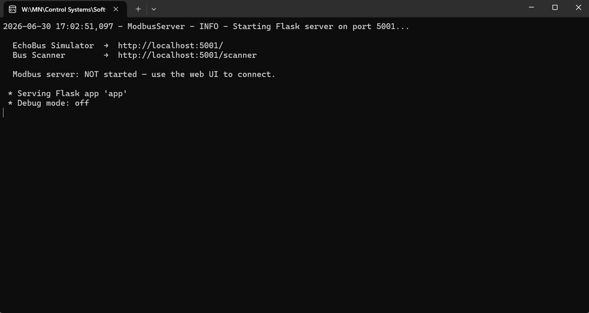

Echobus application running

- Under Pages click Bus Scanner to open the application.
  - Alternate way of opening Bus Scanner is by entering http://localhost:5001/scanner in the browser.

Bus Scanner found on the left side under Pages

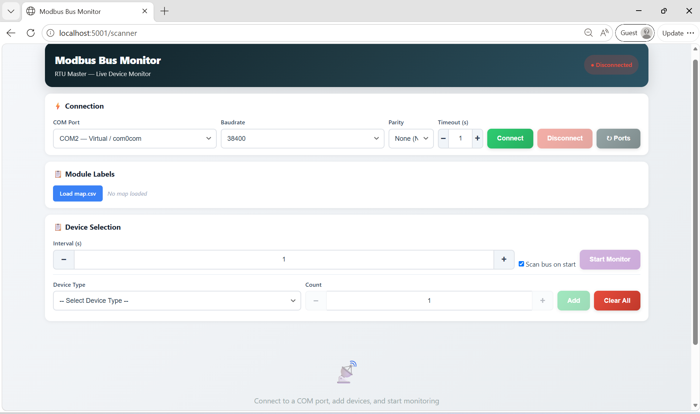

- In the main screen, hover over COM Port and select the appropriate COM# being used from the Test Rig to the serial port, then click Connect.
  - If the connection is not valid, the message "Cannot Open Com#" will appear.
    - Verify the COM wiring on the test rig.
    - Verify COM Port connection to the serial port.

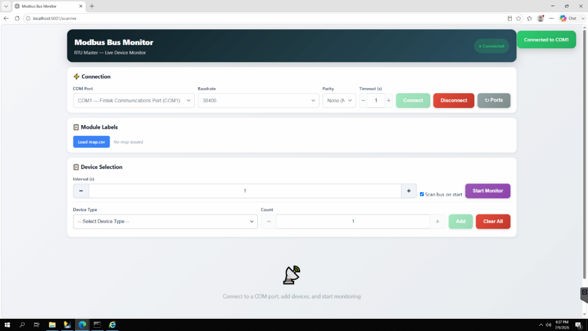

COM Port 1 connection successful

### Device Selection

- On Device Type select MCU (16 devices).
  - On the Count section add necessary number of MCUs to test.

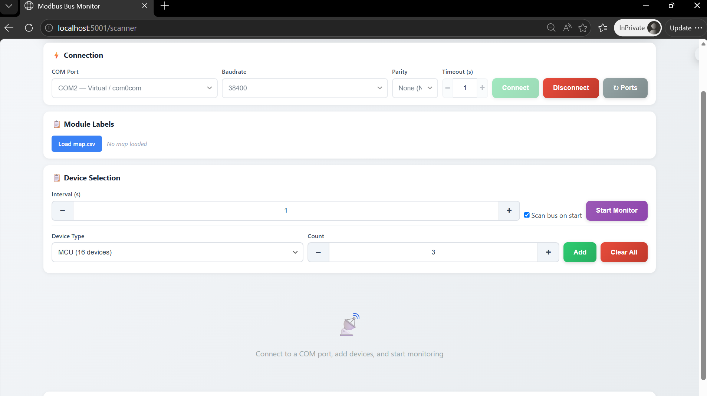

Count is selected for 3 MCUs to test for example

  - Adjust the modbus dip switch address on the MCU based on the module number.
    - E.g., MCU 0-2 set dip switches to 0, 1, and 2.

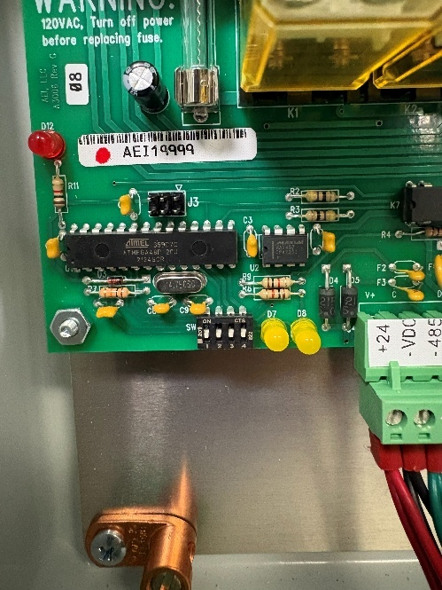

Modbus dip switch on MCU is set for module 0

- Click Add and Start Monitor.

Once the MCU device IDs are added and monitoring, the device ID of the MCU will be displayed and ready to test.

## MCU Test

### Static Pressure Test

- Use the signal generator and plug in the 6 position MCU Static Pressure tester at the top of the signal generator.
  - At the other end of the MCU Static Pressure Tester, plug in the 6 position terminal block to the side of the MCU board.
  - Turn on Signal Generator.

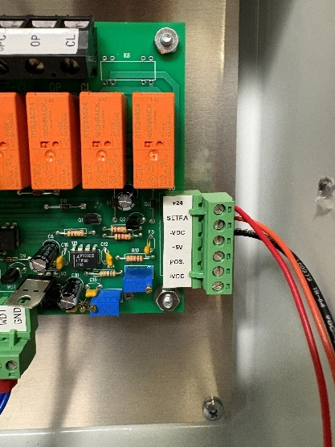

+24, SETRA, and -VDC plugged in for Static Pressure Test

- Set the signal generator to 2.50V.

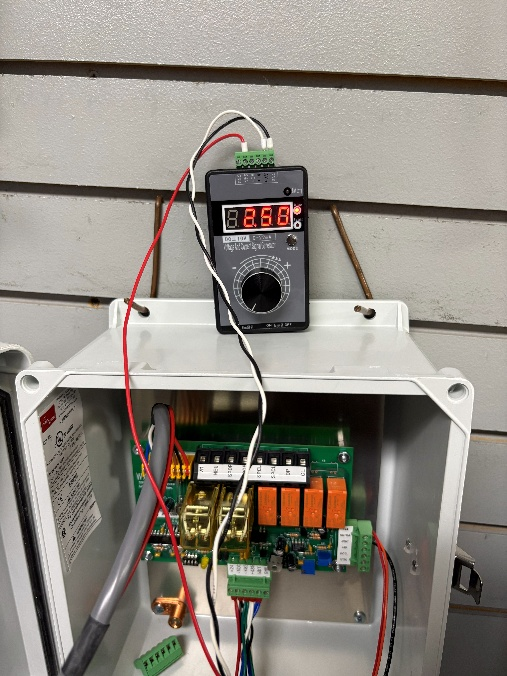

Signal generator set at 2.50V

- On the Bus Scanner, view the Static Press on the MCU module.
  - Verify static pressure corresponds approximately to the signal generator value.

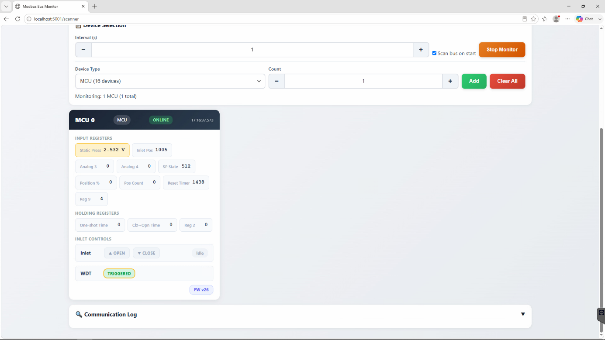

MCU 0 Module responding 2.532V, approximately to the signal generator

- Use the volt generator to test the rest of 0-5V on MCU.
  - 3.50V

MCU 0 receiving 3.50V

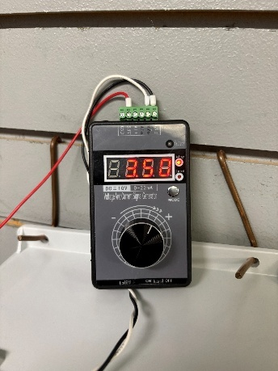

Signal Generator set to 3.50V

  - 5.00V

MCU 0 receiving 5.00V

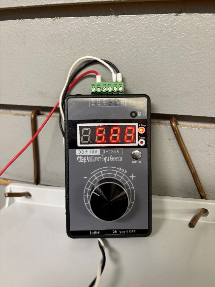

Signal Generator set to 5.00V

### Open and Close Test

- On Bus Scanner hover to the MCU module and click Open.

MCU 0 on Open

- On the front door of the MCU:
  - Ensure toggle switch is set to up on Computer.
  - Observe if Inlet 1 is toggled to Open.

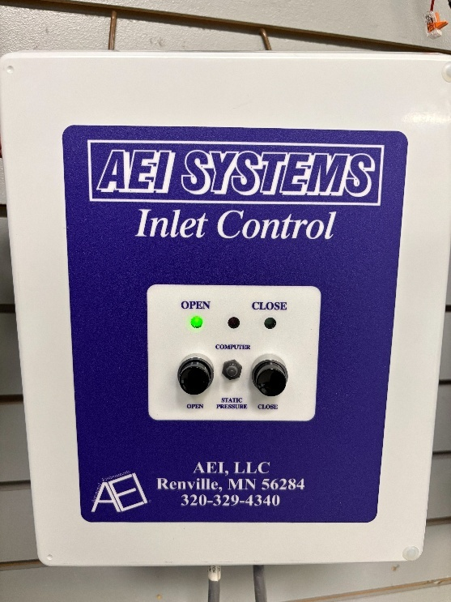

Inlet 1 on Open successfully

- On Bus Scanner, untoggle Open and click Close.
  - MCU Module 0 on Close.

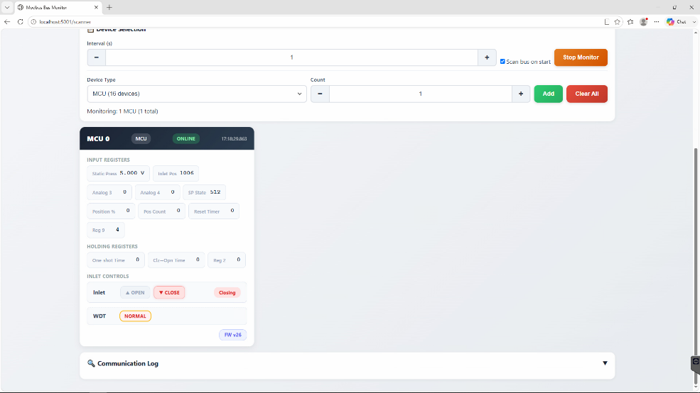

  - MCU on corresponding Close state

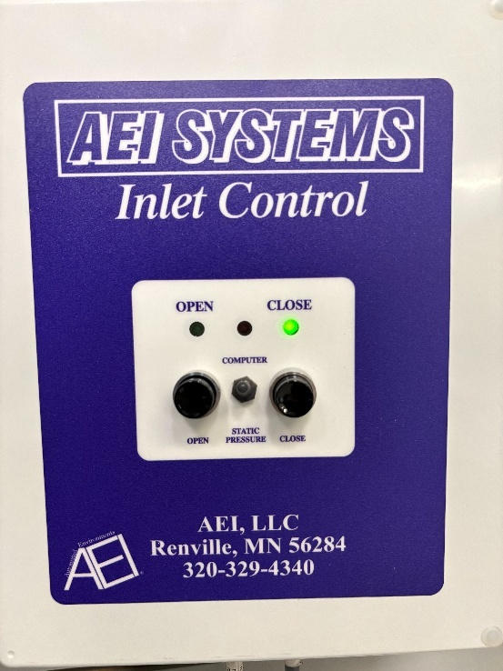

- After finishing the tests, if necessary, apply a label on the front cover of the MCU indicating module number and description based on customer map file.
  - For example Module 0 Front

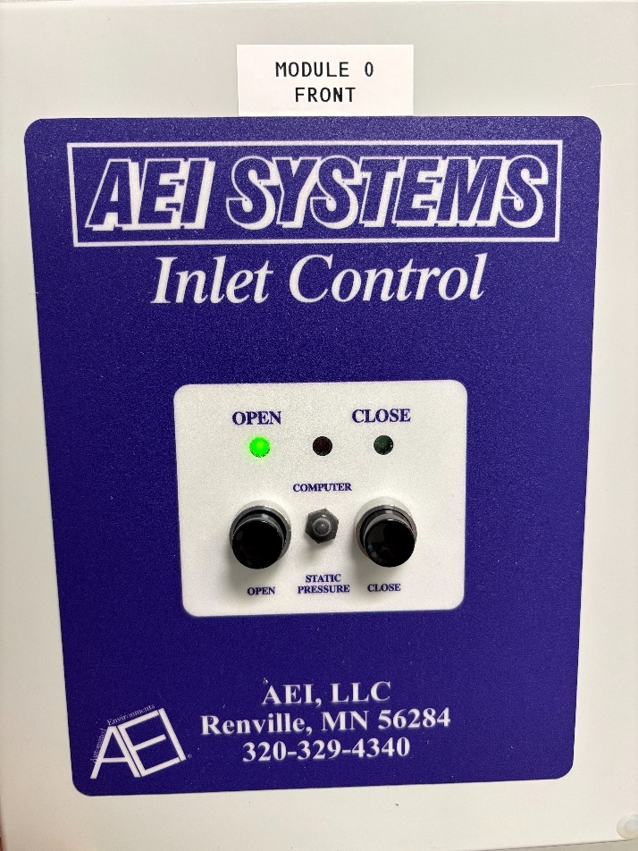

